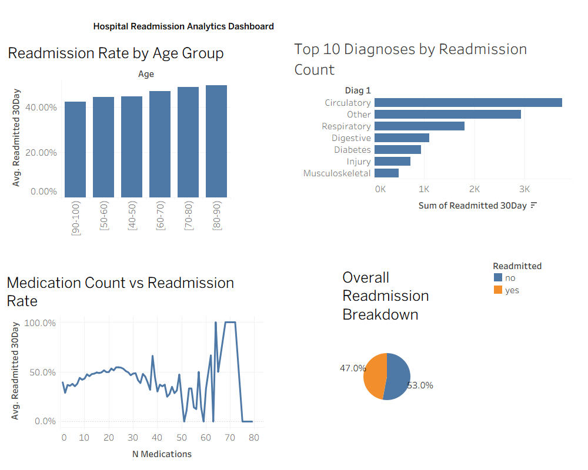

# Hospital Readmission Analytics Dashboard

## Overview
Analyzed 25,000+ patient records to identify key drivers of hospital 
30-day readmissions using SQL, Python, and Tableau.

## Tools
- Python (pandas, matplotlib, seaborn)
- SQL (pandasql)
- Tableau Desktop
- Kaggle

## Key Findings
- Patients aged 80-90 had the highest readmission rate at 49.58%
- Patients aged 70-80 were second at 48.79%
- Circulatory conditions were the #1 diagnosis driving readmissions
- All readmissions occurred in patients aged 40 and above

## Recommendations
1. Flag patients aged 70+ with 20+ medications for mandatory 
   follow-up calls within 7 days of discharge
2. Create diagnosis-specific post-discharge protocols for 
   Circulatory and Respiratory conditions

## Dashboard Preview

## Files
- `hospital_data_analysis_sql.ipynb` — Full SQL and Python analysis
- `readmissions_cleaned.csv` — Cleaned dataset (25,000+ records)
- `Dashboard_health.png` — Tableau dashboard export

## Data Source
Kaggle — https://www.kaggle.com/datasets/dubradave/hospital-readmissions
